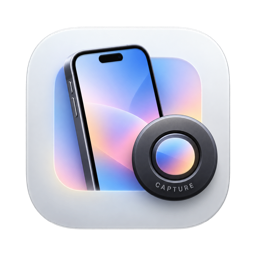

<p align="center">
  
</p>

<h1 align="center">Capture</h1>

<p align="center">
  Clean iPhone screenshots and screen recordings, straight from your Mac.<br>
  The 9:41 status bar Apple uses in its own product shots, without the QuickTime hassle.
</p>

<p align="center">
  
  
</p>

---

## Why Capture?

When a Mac opens the screen of a USB-connected iPhone (the way QuickTime Player's *New Movie Recording* does), iOS switches to a **demo status bar**: 9:41, full battery, full signal and no notifications. It's perfect for App Store screenshots, marketing visuals and product demos, but QuickTime is not built for that workflow.

Capture is a small, native macOS app designed around it: plug in your iPhone, take a screenshot or record a video, and find everything in one place.

## Features

- [x] Guided onboarding (English and French)
- [x] Automatic iPhone detection over USB
- [x] Live preview that fits the window
- [x] Screenshots at full native resolution
- [x] Screen recordings with sound
- [x] Screenshot editor: device frame with the display corners of each model, background (color, gradient, image), margin and shadow
- [x] Export as PNG, JPEG or HEIC at ½x, 1x or 2x, or copy to the clipboard
- [x] Recent captures
- [x] Settings: save location, erase data, default quality, theme, file name templates, folder organization, direct export to `_Exports`
- [x] Video editor: trim, split and delete segments with undo, rotate, speed, volume, an added music or voice-over track, and the same device frame and background as screenshots
- [x] Portrait, landscape left, landscape right and upside-down device frames, and 1:1, 9:16 or 16:9 output
- [x] Video export as MP4 or MOV (HEVC), at the source resolution, 1080p or 720p, and 24 to 60 fps
- [ ] Automatic updates from GitHub releases
- [ ] Signed and notarized DMG

Screenshots and videos are saved to the folder chosen during onboarding (`~/Desktop/Capture` by default). File names can use variables such as `{device}`, `{date}`, `{time}`, `{counter}` and `{type}`, and captures can be sorted into subfolders by date or device. Shortcuts: **⇧⌘S** for a screenshot, **⇧⌘R** to start or stop a recording.

## Requirements

- macOS 26 or later
- An iPhone connected **with a USB cable** (the demo status bar is not available over Wi-Fi)
- Camera access: macOS exposes the iPhone screen as a camera device, so Capture asks for it on first launch. Nothing leaves your Mac.

## How it works

iOS devices are hidden from AVFoundation until an app opts in through CoreMediaIO:

```swift
var address = CMIOObjectPropertyAddress(
    mSelector: CMIOObjectPropertySelector(kCMIOHardwarePropertyAllowScreenCaptureDevices),
    mScope: CMIOObjectPropertyScope(kCMIOObjectPropertyScopeGlobal),
    mElement: CMIOObjectPropertyElement(kCMIOObjectPropertyElementMain)
)
var allow: UInt32 = 1
CMIOObjectSetPropertyData(CMIOObjectID(kCMIOObjectSystemObject), &address, 0, nil,
                          UInt32(MemoryLayout.size(ofValue: allow)), &allow)
```

The iPhone then shows up as an external `AVCaptureDevice` with the `.muxed` media type. As soon as a capture session starts streaming from it, iOS switches its status bar to demo mode.

## Building

1. Install Xcode 26 or later.
2. Clone the repository and open `Capture.xcodeproj`.
3. Build and run the **Capture** scheme.

The project is signed to run locally by default. Pick your own team in *Signing & Capabilities* to sign with your certificate: with ad-hoc signing, macOS asks for camera access again after every build.

The Xcode project is generated from `project.yml` with [XcodeGen](https://github.com/yonaskolb/XcodeGen). After adding or removing files, run:

```sh
xcodegen generate
```

## Project structure

```
Capture/
├── App/            App entry point
├── Device/         iPhone discovery, capture session and live preview
├── Main/           Main window: sidebar, empty state, preview
├── Editor/         Screenshot editor: device frame, background, export
├── Library/        Captures found in the save folder
├── Onboarding/     First-launch walkthrough
├── Settings/       Preferences and the Settings screen
├── Video/          Video editor: timeline, tools, rendering and export
└── Resources/      Assets and string catalogs (en, fr)
scripts/
├── make-icons.swift  Generates the AppIcon set from Design/AppIcon.png
└── strings.py        Regenerates the string catalogs with French translations
```

## Localization

Capture ships in English and French. Strings live in `Capture/Resources/Localizable.xcstrings`. French translations are maintained in `scripts/strings.py`: edit them there, then run `python3 scripts/strings.py`.

## Contributing

Issues and pull requests are welcome. Please keep the app native, minimal and in line with Apple's Human Interface Guidelines.

## License

See [LICENSE](LICENSE).

iPhone, Mac, macOS and QuickTime are trademarks of Apple Inc. This project is not affiliated with or endorsed by Apple.
